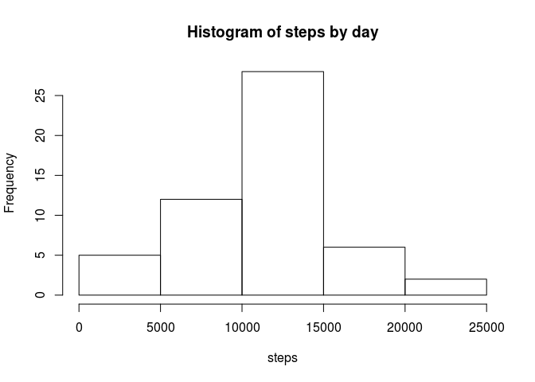
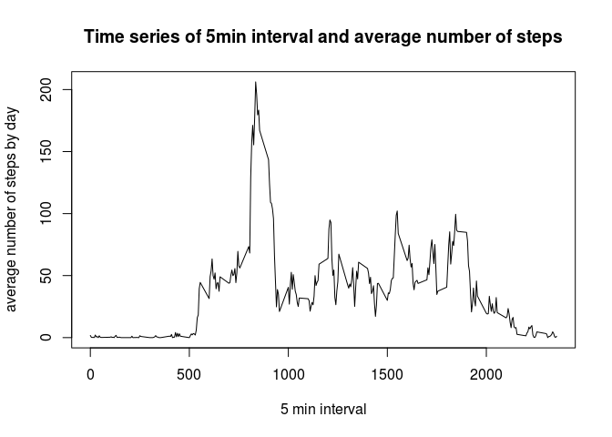
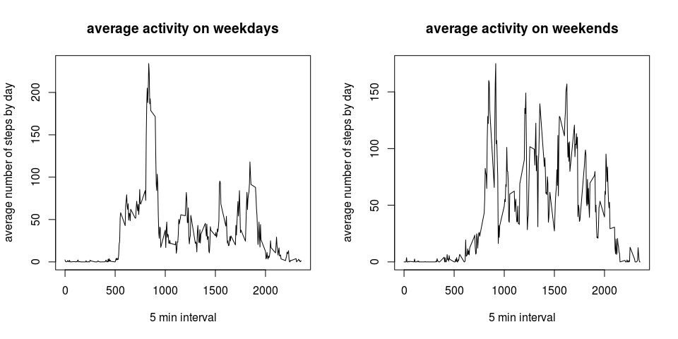

Loading and preprocessing the data
----------------------------------

The data is loaded in `R` environment using the `read.csv()` function.

``` r
csv_file="activity.csv"
activity <- read.csv(csv_file, stringsAsFactors=F)
```

What is mean total number of steps taken per day?
-------------------------------------------------

The dataset has the number of steps taking in a 5-minute interval. For the purpose of this analysis we need to have the total number of steps by day. This is easily accomplished by aggregating the number of steps by date.

``` r
steps_by_day <- aggregate(activity$steps, by=list (activity$date), sum)
names(steps_by_day) <- c("date", "steps")
```

1.  A histogram of the total number of steps taken each day

``` r
hist(steps_by_day$steps, main='Histogram of steps by day', xlab='steps')
```



1.  The mean of total number of steps taken per day (discarding the `NA` values) can be calculated by `mean(steps_by_day$steps, na.rm=T) =` 10766.19 and the median as `median(steps_by_day$steps, na.rm=T) =` 10765.

What is the average daily activity pattern?
-------------------------------------------

To get the average daily activity we need to aggregate the original data by the 5 min interval.

``` r
steps_by_5min <- aggregate(activity$steps, by=list (activity$interval), mean,  na.rm=TRUE )
names(steps_by_5min) <- c("interval", "steps")
```

1.  A time series plot now can be draw

``` r
plot (steps_by_5min$interval, steps_by_5min$steps, type='l', main = "Time series of 5min interval and average number of steps", xlab= "5 min interval", ylab="average number of steps by day")
```



1.  Which 5-minute interval, on average across all the days in the dataset, contains the maximum number of steps?

The 5 minute interval which have the maximum number of steps is returned by the expression `steps_by_5min$interval[steps_by_5min$steps==max (steps_by_5min$steps)]` and it is 835.

Inputing missing values
-----------------------

1.  Calculate and report the total number of missing values in the dataset (i.e. the total number of rows with NAs)

    1.1. the number of `NA` can be evalueted by the expression `sum (is.na(activity$steps))` which returns 2304 rows.

2.  Devise a strategy for filling in all of the missing values in the dataset. The strategy does not need to be sophisticated. For example, you could use the mean/median for that day, or the mean for that 5-minute interval, etc.

    2.1. I will fill the `NA`s in the data using the average of the 5 minute interval calculated before (`steps_by_5min`).

3.  Create a new dataset that is equal to the original dataset but with the missing data filled in.

    3.1. the code

    ``` r
        # preserve the orignal data
        activity_nona <- activity
        # for each line of dataframe
        for (i in 1:length(activity_nona$steps)) {
          # is it a NA in this position ?
          if (is.na (activity_nona$steps[i])) {
            # get the time interval where this NA is
            ti= activity_nona$interval[i]
            # replace the NA with the average steps on that same time interval
            activity_nona$steps[i] <- steps_by_5min$steps[steps_by_5min$interval==ti]
          }
        }
    ```

4.  Make a histogram of the total number of steps taken each day and Calculate and report the mean and median total number of steps taken per day. Do these values differ from the estimates from the first part of the assignment? What is the impact of imputing missing data on the estimates of the total daily number of steps?

    4.1 Again, we need to aggregate the number of steps by each day as before, except this time there is no `NA`s. I will plot the previous graph next to it to make it easier to compare the effect of removing the `NA`s.

    ``` r
    steps_by_day_nona <- aggregate(activity_nona$steps, by=list (activity_nona$date), sum)
    names(steps_by_day_nona) <- c("date", "steps")
    par(mfrow= c(1, 2))
    hist(steps_by_day_nona$steps, main='Histogram of steps by day (NA removed)', xlab='steps')
    hist(steps_by_day$steps, main='Histogram of steps by day (original)', xlab='steps')
    ```

    

    The mean and average for this new dataset is calculated as before. I will put both scenarios in the table bellow to make easier to compare the effect of removing the `NA`s.

    |          |  original data|  `NA`s removed|
    |:--------:|--------------:|--------------:|
    |  `mean`  |       10766.19|       10766.19|
    | `median` |          10765|       10766.19|

    And yes, they do differ, both the median (yet, slightly) as the frequency between 10.000 and 15.000 steps.

Are there differences in activity patterns between weekdays and weekends?
-------------------------------------------------------------------------

Lets create a factor variable on activity (`dow`), based on the day of week: weekday and weekend.

``` r
activity$dow <- factor (c("weekday", "weekend")[weekdays(as.Date(activity$date), TRUE) %in% c("Sat", "Sun")+1])
```

Now its the same as we did before to get the average daily activity above, but this time, filtered by "weekday" and "weekend".

``` r
# filtered by weekday
steps_by_5min_weekday <- aggregate(activity$steps[activity$dow=='weekday'], by=list (activity$interval[activity$dow=='weekday']), mean,  na.rm=TRUE )
names(steps_by_5min_weekday) <- c("interval", "steps")
# filtered by weekend
steps_by_5min_weekend <- aggregate(activity$steps[activity$dow=='weekend'], by=list (activity$interval[activity$dow=='weekend']), mean,  na.rm=TRUE )
names(steps_by_5min_weekend) <- c("interval", "steps")
```

The plot of average daily activity on weekdays and on weekends:

``` r
par(mfrow= c(1, 2))
plot (steps_by_5min_weekday$interval, steps_by_5min_weekday$steps, type='l', main = "average activity on weekdays", xlab= "5 min interval", ylab="average number of steps by day")
plot (steps_by_5min_weekend$interval, steps_by_5min_weekend$steps, type='l', main = "average activity on weekends", xlab= "5 min interval", ylab="average number of steps by day")
```



So, clearly there are differences in the activity pattern between weekdays and wekkends.
